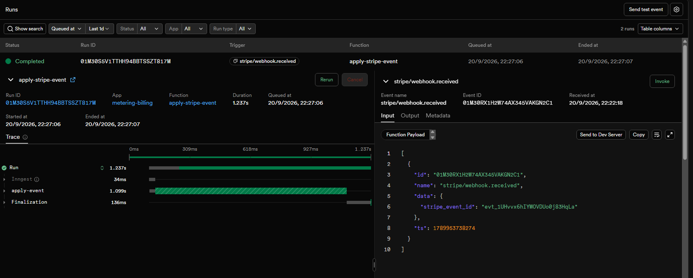

# Evidence

One pasted proof per requirement in Section 6 of the capstone brief.
Transcripts are real terminal output, unedited except for line wrapping.

Every requirement in Section 6 has a proof below; none are outstanding.

All transcripts use the seeded demo tenant
`37e4cb17-1ecc-4af4-8eaf-5e0a450902fd`, exported as `$TENANT`. The Stripe
sections run in order against one subscription lifecycle — checkout, then
replay, then cancellation — so the tenant is on Pro in the middle transcripts
and back on Free at the end.

---

## Metering

### A billable action creates exactly one usage event, even under retries

Same request, same `Idempotency-Key`, sent twice. The bodies are written to
files and compared, because "the second response mirrors the first" is a
claim about bytes, not about looking similar.

```bash
KEY=normalize-check

curl -s -X POST http://localhost:8000/generate \
  -H "Content-Type: application/json" \
  -H "X-Tenant-Id: $TENANT" \
  -H "Idempotency-Key: $KEY" \
  -d '{"input_tokens":100,"output_tokens":200}' > /tmp/first.json

curl -s -X POST http://localhost:8000/generate \
  -H "Content-Type: application/json" \
  -H "X-Tenant-Id: $TENANT" \
  -H "Idempotency-Key: $KEY" \
  -d '{"input_tokens":100,"output_tokens":200}' > /tmp/second.json

diff /tmp/first.json /tmp/second.json && echo "IDENTICAL"
```

```text
IDENTICAL
```

`diff` printed nothing: the replayed body is byte-for-byte the original.
This needed a fix — JSONB does not preserve key order, so the stored
response came back with its keys shuffled. Every response now passes through
a recursive sort in `app/routers/generate.py` before it leaves the API.

The two calls are distinguishable by status code and header:

```text
First call:   HTTP/1.1 201 Created    idempotent-replay: false
Second call:  HTTP/1.1 200 OK         idempotent-replay: true
```

`201` for the event that was created, `200` for the one that already
existed. A replay is not a creation.

### Proof that double-counting cannot happen

The database after a request and its retry:

```bash
docker compose exec db psql -U billing -d billing \
  -c "SELECT count(*) FROM usage_events;" \
  -c "SELECT metric, quantity FROM usage_event_items;"
```

```text
 count
-------
     1
(1 row)

       metric        | quantity
---------------------+----------
 api_calls           |        1
 input_tokens        |     1000
 cached_input_tokens |      500
 output_tokens       |     2000
 reasoning_tokens    |      300
(5 rows)
```

One event row, five metric rows — the second request wrote nothing.

The guarantee is `UNIQUE (tenant_id, idempotency_key)` plus
`INSERT ... ON CONFLICT DO NOTHING RETURNING id` in
`app/repositories/usage.py`. A `SELECT`-then-`INSERT` would let two
concurrent retries both find nothing and both insert; here Postgres
arbitrates and exactly one wins.

### A reused key with a different body is rejected, not replayed

Same `Idempotency-Key`, different token counts:

```bash
curl -i -X POST http://localhost:8000/generate \
  -H "Content-Type: application/json" \
  -H "X-Tenant-Id: $TENANT" \
  -H "Idempotency-Key: probe-1" \
  -d '{"input_tokens":9999,"output_tokens":1}'
```

```text
HTTP/1.1 422 Unprocessable Content

{"detail":{"error":"idempotency_key_reused","message":"This Idempotency-Key
was already used with a different request body."}}
```

Replaying the stored response here would answer a question the caller never
asked. The check compares a SHA-256 of the canonically serialized payload,
stored as `request_hash`. `sort_keys` is used on the way in, so the same
metrics in a different JSON order still hash the same and a legitimate retry
is never mistaken for key reuse.

---

## Quotas

### Usage is checked against the tenant's plan; requests over the limit are rejected

Free plan: 1,000 API calls and 100,000 tokens per month. Three requests of
40,000 output tokens each, on top of 3,800 tokens already recorded:

```bash
for i in 1 2 3; do
  echo "--- request $i ---"
  curl -s -o /dev/null -w "%{http_code}\n" -X POST http://localhost:8000/generate \
    -H "Content-Type: application/json" \
    -H "X-Tenant-Id: $TENANT" \
    -H "Idempotency-Key: quota-$i" \
    -d '{"output_tokens":40000}'
done
```

```text
--- request 1 ---
201
--- request 2 ---
201
--- request 3 ---
402
```

3,800 + 40,000 + 40,000 = 83,800. The third request would reach 123,800 and
is refused.

### The request at the boundary behaves per the documented rule

The rule, from DESIGN.md section 3.1:

```text
current_usage + requested <= limit  ->  allowed
```

At 83,800 used, a request for exactly the remaining 16,200:

```bash
curl -i -X POST http://localhost:8000/generate \
  -H "Content-Type: application/json" \
  -H "X-Tenant-Id: $TENANT" \
  -H "Idempotency-Key: boundary-exact" \
  -d '{"output_tokens":16200}'
```

```text
HTTP/1.1 201 Created
idempotent-replay: false

{"cost_usd":"$0.121600","cost_uusd":121600,
"event_id":"f19c65f8-c53c-414f-b591-f2999c6d5bd3",
"metrics":{"api_calls":1,"input_tokens":0,"cached_input_tokens":0,
"output_tokens":16200,"reasoning_tokens":0},
"quota":{"api_calls":{"used":4,"limit":1000,"remaining":996},
"tokens":{"used":100000,"limit":100000,"remaining":0}}}
```

Allowed, landing on exactly 100,000 with `remaining: 0`. The quota is a
ceiling that may be reached but not crossed.

### A retry at the exact limit is replayed, not rejected

Same command again, with the tenant now sitting at 100,000 of 100,000:

```text
HTTP/1.1 200 OK
idempotent-replay: true
```

This is the case that separates a correct implementation from one that was
adjusted until the tests passed. That usage is already counted; answering
`402` to a retry would break idempotency for every tenant at its limit. The
service looks up the idempotency key *before* it checks quota, and the
ordering is the reason — see the docstring on `record()` in
`app/services/meter.py`.

### Responses carry the correct status codes and a message explaining why

**402 — the tenant is on Free, and a payment action unblocks it:**

```bash
curl -i -X POST http://localhost:8000/generate \
  -H "Content-Type: application/json" \
  -H "X-Tenant-Id: $TENANT" \
  -H "Idempotency-Key: boundary-over" \
  -d '{"output_tokens":1}'
```

```text
HTTP/1.1 402 Payment Required

{"detail":{"error":"quota_exceeded","limit_name":"tokens","limit":100000,
"used":100000,"requested":1,"message":"This request needs 1 tokens but only
0 remain of 100000 this period. Upgrade to Pro for a higher limit."}}
```

**429 — the tenant is on a paid plan and the period is spent:**

Note: Pro's real token limit is 5,000,000, which would take 125 requests to
exhaust. The limit was temporarily lowered to 90,000 to make this path
observable, then restored by re-running the seed.

```bash
docker compose exec db psql -U billing -d billing \
  -c "UPDATE tenants SET plan_code='pro' WHERE id='$TENANT';" \
  -c "UPDATE plans SET token_limit=90000 WHERE code='pro';"

curl -i -X POST http://localhost:8000/generate \
  -H "Content-Type: application/json" \
  -H "X-Tenant-Id: $TENANT" \
  -H "Idempotency-Key: paid-over" \
  -d '{"output_tokens":1}'
```

```text
HTTP/1.1 429 Too Many Requests

{"detail":{"error":"quota_exceeded","limit_name":"tokens","limit":90000,
"used":100000,"requested":1,"message":"This request needs 1 tokens but only
0 remain of 90000 this period. The quota resets at the start of next
month."}}
```

Same rejection, different remedy. `402` means a payment unblocks the caller;
`429` means there is nothing to buy and the quota resets next month. Both
bodies carry `used`, `limit` and `requested`, so a client can act on the
refusal instead of guessing.

### Concurrency at the boundary

Quota is an aggregate, and an aggregate cannot be protected by a constraint
on a row that does not exist yet. Two concurrent requests with different
idempotency keys would both read the same total, both conclude there is
room, and both record.

`app/repositories/tenants.py` takes a `SELECT ... FOR UPDATE` row lock on the
tenant before reading usage, so quota checks for one tenant serialize while
different tenants never block each other. Alternatives considered:
`SERIALIZABLE` isolation with retry logic, and tolerating a small overshoot
the way high-volume metering systems do. Both are recorded in DESIGN.md.

---

## Cost calculation

### Pricing constants are pinned in config, with proof of correct totals

Constants live in `app/config.py`, not in the database, so a historical
rollup cannot change because someone edited a row. Rates are micro-USD per
1,000,000 tokens.

Manual verification of a request with 1,000 input, 500 cached input, 2,000
output and 300 reasoning tokens, which returned `cost_uusd: 18925`:

| Metric | Quantity | Rate | Contribution (µUSD) |
| --- | --- | --- | --- |
| `input_tokens` | 1,000 | 1,500,000 / 1M | 1,500 |
| `cached_input_tokens` | 500 | 150,000 / 1M | 75 |
| `output_tokens` | 2,000 | 7,500,000 / 1M | 15,000 |
| `reasoning_tokens` | 300 | 7,500,000 / 1M | 2,250 |
| `api_calls` | 1 | 100 µUSD / call | 100 |
| **Total** | | | **18,925** |

Both rules the brief calls out are visible: 500 cached input tokens
contribute 75 µUSD while 1,000 fresh input tokens contribute 1,500 — cached
reads bill at 10% of the input rate; and 300 reasoning tokens are priced at
the output rate, not as a free category. The four categories are never
summed into a single quantity before pricing.

Rounding happens once, on the summed raw accumulator, using integer
arithmetic only. `round(raw / 1_000_000)` would route the value through a
float on the way — see `app/services/cost.py`.

### Monthly usage rolls up into a cost figure per tenant

`GET /usage` aggregates every event in the current period into one summary —
used, limit and cost:

```bash
curl -s http://localhost:8000/usage -H "X-Tenant-Id: $TENANT"
```

```text
{"tenant_id":"37e4cb17-1ecc-4af4-8eaf-5e0a450902fd","plan":"free",
 "period_start":"2026-09-01T00:00:00+00:00",
 "usage":{"api_calls":{"used":2,"limit":1000,"remaining":998},
          "tokens":{"used":4000,"limit":100000,"remaining":96000}},
 "breakdown":{"api_calls":2,"input_tokens":1000,"cached_input_tokens":1000,
              "output_tokens":1000,"reasoning_tokens":1000},
 "cost_uusd":16850,"cost_usd":"$0.016850"}
```

The rollup is not taken on trust — the total is re-derived from the pinned
constants in `app/config.py` and the `breakdown` the endpoint itself reports:

| Metric | Quantity | Rate | Contribution (µUSD) |
| --- | --- | --- | --- |
| `input_tokens` | 1,000 | 1,500,000 / 1M | 1,500 |
| `cached_input_tokens` | 1,000 | 150,000 / 1M | 150 |
| `output_tokens` | 1,000 | 7,500,000 / 1M | 7,500 |
| `reasoning_tokens` | 1,000 | 7,500,000 / 1M | 7,500 |
| `api_calls` | 2 | 100 µUSD / call | 200 |
| **Total** | | | **16,850** |

16,850 µUSD, matching `cost_uusd` exactly. Equal quantities of each token
category are used on purpose: the four contributions come out to 1,500, 150,
7,500 and 7,500 from the *same* 1,000 tokens, so the table shows the
categories being priced separately rather than summed. A rollup that added
the categories first would report 4,000 tokens at one blended rate and land
on a different number.

`tokens.used` is 4,000 — all four categories count against the quota
equally, even though they bill at three different rates. Quota and cost
answer different questions: the quota meters consumption, the price reflects
what that consumption costs to serve.

Note this row is the same tenant after the cancellation proved below, hence
`plan: free` and the 100,000 ceiling. `used` and `cost_uusd` are unchanged by
that downgrade.

---

## Stripe integration

### A forged webhook is rejected and changes nothing

"Nothing changed" is a claim about a difference, so the table and the plan
are read before and after rather than only after.

```bash
docker compose exec db psql -U billing -d billing \
  -c "SELECT count(*) FROM processed_webhook_events;" \
  -c "SELECT plan_code FROM tenants;"

curl -i -X POST http://localhost:8000/webhooks/stripe \
  -H "Content-Type: application/json" \
  -H "Stripe-Signature: t=123,v1=firmafalsa" \
  -d '{"id":"evt_forjado","type":"checkout.session.completed"}'
```

```text
=== BEFORE ===
 count
-------
     2
(1 row)

 plan_code
-----------
 pro
(1 row)

=== FORGED REQUEST ===
HTTP/1.1 400 Bad Request

{"detail":{"error":"invalid_signature","message":"Signature verification failed."}}
```

```bash
docker compose exec db psql -U billing -d billing \
  -c "SELECT count(*) FROM processed_webhook_events;" \
  -c "SELECT plan_code FROM tenants;" \
  -c "SELECT stripe_event_id FROM processed_webhook_events
      WHERE stripe_event_id='evt_forjado';"
```

```text
=== AFTER ===
 count
-------
     2
(1 row)

 plan_code
-----------
 pro
(1 row)

 stripe_event_id
-----------------
(0 rows)
```

The count is unchanged at 2, the plan is unchanged, and the forged id is
absent from the table. The count is deliberately not `0` here: this probe was
run against a database that had already processed real events, which is the
harder case. An empty table would prove the forgery was rejected only by
accident of there being nothing there to begin with.

Nothing stored, nothing enqueued. The signature is checked against the raw
request bytes before a single field is read out of the payload — parsing to
a model and re-serializing would change whitespace and key order and break
verification on legitimate events, so this endpoint deliberately skips
Pydantic.

### Subscription checkout works end-to-end in test mode

```bash
curl -s -X POST http://localhost:8000/checkout -H "X-Tenant-Id: $TENANT"
```

```text
{"checkout_url":"https://checkout.stripe.com/c/pay/cs_test_a1Sjt0xO61PR1C54G0HZKxqxRJryOqWbEJlPHHTWQGpITCzJ5kAWuWxDYM#..."}
```

Paid with test card `4242 4242 4242 4242`. Stripe redirects to the local
success page:

```text
{"status":"checkout_completed","session_id":"cs_test_a1Sjt0xO61PR1C54G0HZKxqxRJryOqWbEJlPHHTWQGpITCzJ5kAWuWxDYM","note":"Plan changes apply once the webhook is processed."}
```

The endpoint writes nothing to the database. At this point the customer has
paid and the tenant is still on Free — the plan changes because a signed
webhook says so, not because `/checkout` was called.

### The webhook flips the tenant Free to Pro, and GET /usage shows the new limits

Stripe CLI forwarding the event:

```text
2026-09-20 22:22:18  --> checkout.session.completed [evt_1UHvvx6hIYWOVDUo0j83HqLa]
2026-09-20 22:22:18  <--  [200] POST http://localhost:8000/webhooks/stripe
```

`GET /usage` before and after the event is applied:

```text
before: {"plan":"free","usage":{"api_calls":{"used":2,"limit":1000,"remaining":998},
         "tokens":{"used":4000,"limit":100000,"remaining":96000}}, ...}

after:  {"plan":"pro","usage":{"api_calls":{"used":2,"limit":50000,"remaining":49998},
         "tokens":{"used":4000,"limit":5000000,"remaining":4996000}}, ...}
```

The limits moved; `used` did not. A plan change raises the ceiling, it does
not erase consumption — the usage in a period is a fact independent of which
plan was in force while it was spent.

### A cancellation drops the tenant back to Free

The requirement is that webhooks update the tenant's plan *and status*, so
the downgrade is worth proving separately: an upgrade path that works says
nothing about whether entitlement is ever withdrawn.

Cancelling the real subscription created by the checkout above:

```bash
stripe subscriptions cancel sub_1UHvvw6hIYWOVDUoOWYLko4z --confirm
```

```text
  "id": "sub_1UHvvw6hIYWOVDUoOWYLko4z",
  "canceled_at": 1789955044,
  "customer": "cus_VIWzGHoEj0Nokn",
  "status": "canceled",
```

Stripe emits `customer.subscription.deleted`, which arrives over the same
verified path:

```bash
docker compose exec db psql -U billing -d billing \
  -c "SELECT stripe_event_id, event_type, status, processed_at
      FROM processed_webhook_events ORDER BY received_at;"
```

```text
       stripe_event_id        |          event_type           |  status   |         processed_at
------------------------------+-------------------------------+-----------+-------------------------------
 evt_1UHvig6hIYWOVDUoQTc4prCZ | checkout.session.completed    | failed    | 2026-09-21 01:10:02.789475+00
 evt_1UHvvx6hIYWOVDUo0j83HqLa | checkout.session.completed    | processed | 2026-09-21 01:27:07.63883+00
 evt_1UHwH36hIYWOVDUo8BWY9ieR | customer.subscription.deleted | processed | 2026-09-21 01:44:05.249104+00
(3 rows)
```

The `failed` row at the top is left in rather than cleaned out of the
transcript. It is a real checkout from an earlier run, against a different
subscription, that exhausted its three attempts during development. It is
shown deliberately: it is the `on_failure` handler described under shared
requirement #3 doing exactly what it exists for — a spent event ends at
`failed`, not sitting at `received` where "still working" and "never going
to happen" look identical.

The local mirror afterwards:

```text
 plan_code |  status
-----------+----------
 free      | canceled
(1 row)

 plan_code
-----------
 free
(1 row)
```

`GET /usage` before and after the cancellation:

```text
before: {"plan":"pro", "usage":{"api_calls":{"used":2,"limit":50000,"remaining":49998},
         "tokens":{"used":4000,"limit":5000000,"remaining":4996000}}, ...}

after:  {"plan":"free","usage":{"api_calls":{"used":2,"limit":1000,"remaining":998},
         "tokens":{"used":4000,"limit":100000,"remaining":96000}}, ...}
```

The ceiling falls from 5,000,000 back to 100,000 while `used` stays at 4,000
— the same invariant as the upgrade, running in the other direction. A tenant
that consumed 4,000 tokens on Pro still has consumed them after cancelling.

Two details in the subscription row are the reason this works at all. The
`status` column keeps Stripe's own word, `canceled`, while `plan_code` is
this system's derived answer, `free`; `_plan_for()` in
`app/services/billing.py` is the only place that translation happens, so
`past_due` and `unpaid` lose entitlement by the same rule rather than needing
their own branch.

The second is the tenant id. A `customer.subscription.deleted` event carries
a subscription, not a checkout session, so it has no `client_reference_id` to
read. It resolves only because `create_checkout_session()` attached the
tenant id to `subscription_data.metadata` at checkout time, where it rides on
every later event about that subscription:

```bash
docker compose exec db psql -U billing -d billing -t \
  -c "SELECT payload->'data'->'object'->>'status',
             payload->'data'->'object'->>'id',
             payload->'data'->'object'->'metadata'->>'tenant_id'
      FROM processed_webhook_events
      WHERE stripe_event_id='evt_1UHwH36hIYWOVDUo8BWY9ieR';"
```

```text
 canceled | sub_1UHvvw6hIYWOVDUoOWYLko4z | 37e4cb17-1ecc-4af4-8eaf-5e0a450902fd
```

Setting that metadata is one line at checkout and easy to omit, because
nothing fails until the first cancellation — months later, on the one event
that decides whether a tenant keeps paid limits for free.

Finally, the downgrade is enforced rather than merely recorded. A request
that Pro's 5,000,000-token ceiling would have allowed:

```bash
curl -s -o /dev/null -w "status=%{http_code}\n" \
  -X POST http://localhost:8000/generate \
  -H "Content-Type: application/json" \
  -H "X-Tenant-Id: $TENANT" \
  -H "Idempotency-Key: post-cancel-check" \
  -d '{"output_tokens":200000}'
```

```text
status=402
```

Refused against the restored Free limit — and `402` rather than `429`,
because a cancelled tenant is precisely the case where a payment unblocks
the caller. The cancellation path and the quota path agree without either
knowing about the other: billing writes `plan_code`, the quota layer reads
the plan's limits, and the status code follows from the plan being unpaid.

### A replayed event is processed once

```bash
stripe events resend evt_1UHvvx6hIYWOVDUo0j83HqLa
```

```text
2026-09-20 22:28:12  --> checkout.session.completed [evt_1UHvvx6hIYWOVDUo0j83HqLa]
2026-09-20 22:28:12  <--  [200] POST http://localhost:8000/webhooks/stripe
```

The second delivery answers `200` on purpose: an error response would tell
Stripe the delivery failed and it would keep redelivering an event already
handled. The body reports `{"status":"duplicate"}` and no work is enqueued.

The CLI prints local time (UTC-3) while Postgres stores UTC, so the
`22:28:12` above and the `01:27`/`01:42` timestamps below are the same
evening, not a contradiction.

The stored row, read before and after the resend:

```bash
docker compose exec db psql -U billing -d billing \
  -c "SELECT stripe_event_id, status, processed_at FROM processed_webhook_events
      WHERE stripe_event_id='evt_1UHvvx6hIYWOVDUo0j83HqLa';"
```

```text
=== BEFORE RESEND ===
       stripe_event_id        |  status   |         processed_at
------------------------------+-----------+------------------------------
 evt_1UHvvx6hIYWOVDUo0j83HqLa | processed | 2026-09-21 01:27:07.63883+00
(1 row)

=== AFTER RESEND ===
       stripe_event_id        |  status   |         processed_at
------------------------------+-----------+------------------------------
 evt_1UHvvx6hIYWOVDUo0j83HqLa | processed | 2026-09-21 01:27:07.63883+00
(1 row)

 total_rows
------------
          2
(1 row)
```

One row, and `processed_at` is identical on both sides — still
`01:27:07.63883`, the moment of the *first* delivery, roughly fifteen minutes
before the resend at `01:42`. That timestamp is the load-bearing part of this
proof. A row count of one only shows nothing was inserted twice; an unmoved
`processed_at` shows the handler did not re-run and quietly overwrite its own
row, which is the failure mode a primary key alone would not catch.

`total_rows` is 2 because this probe ran before the cancellation above, which
later added a third row. The table-wide count is incidental here; the
per-event row and its timestamp are the proof.

Deduplication is the primary key on `stripe_event_id` plus the same
`INSERT ... ON CONFLICT DO NOTHING` that protects the metering path — the
same guarantee on a different table.

---

## Shared requirements

### #1 — Layered architecture: data / logic / HTTP separated

`app/routers/` issues no SQL. `app/services/` imports nothing from FastAPI —
a quota rejection carries a `remedy` ("upgrade" or "wait") and the router
decides which status code that deserves. `app/repositories/` is the only
layer that writes queries. See DESIGN.md section 5.

### #2 — Validation at the boundary: bad input yields a clean 4xx, never a 500

Request with no `Idempotency-Key` header:

```bash
curl -i -X POST http://localhost:8000/generate \
  -H "Content-Type: application/json" \
  -H "X-Tenant-Id: $TENANT" \
  -d '{"input_tokens":1000,"cached_input_tokens":500,"output_tokens":2000,"reasoning_tokens":300}'
```

```text
HTTP/1.1 400 Bad Request

{"error":"invalid_input","field":"idempotency-key","message":"Field required"}
```

No event is created. The handler in `app/main.py` rewrites FastAPI's default
422 into a 400 with a single error shape, which leaves 422 free to mean
"idempotency key reused" and nothing else.

Negative token counts are rejected twice over: `ge=0` in the Pydantic model
at the edge, and a `CHECK (quantity >= 0)` constraint in the database as the
last line of defence.

### #3 — At least one background job

The Stripe webhook handler verifies the signature, records the event id and
returns `200` immediately; applying the event runs as an Inngest function off
the request path.



The run took 1.237s, of which the `apply-event` step was 1.099s. That second
is the API call back to Stripe for the authoritative subscription status —
a second of network I/O that would otherwise happen inside the webhook
handler, while Stripe waits and its retry timer runs.

Retries and the failure path are configured rather than assumed:
`retries=2` gives three attempts with backoff, and `on_failure` marks the
stored event `failed` once they are spent. Without that handler a failed
event would sit at `received` forever, with nothing to distinguish "still
working" from "never going to happen".

The retries are not decoration here. Stripe does not guarantee event order,
so a `customer.subscription.updated` can arrive before the
`checkout.session.completed` that created its metadata; the first attempt
fails, and by the second the other event has landed.

### #4 — Real persistence: schema as migrations, right indexes, isolated tenants

Schema is managed by Alembic. Tenant isolation is enforced at the schema
level: `tenant_id` is part of the uniqueness constraint on `usage_events`, so
two tenants can independently use the same idempotency key without
colliding.

```bash
docker compose exec db psql -U billing -d billing -c "\d usage_events"
```

```text
                          Table "public.usage_events"
     Column      |           Type           | Nullable |  Default
-----------------+--------------------------+----------+-----------
 id              | uuid                     | not null |
 tenant_id       | uuid                     | not null |
 idempotency_key | character varying(255)   | not null |
 kind            | character varying(32)    | not null |
 request_hash    | character varying(64)    | not null |
 response_body   | jsonb                    | not null |
 created_at      | timestamp with time zone | not null | now()
Indexes:
    "usage_events_pkey" PRIMARY KEY, btree (id)
    "ix_usage_events_tenant_created" btree (tenant_id, created_at)
    "uq_usage_events_tenant_key" UNIQUE CONSTRAINT, btree (tenant_id, idempotency_key)
Check constraints:
    "ck_usage_events_kind" CHECK (kind::text = ANY (ARRAY['api_call'::character varying, 'ai_tokens'::character varying]::text[]))
Foreign-key constraints:
    "usage_events_tenant_id_fkey" FOREIGN KEY (tenant_id) REFERENCES tenants(id) ON DELETE CASCADE
Referenced by:
    TABLE "usage_event_items" CONSTRAINT "usage_event_items_event_id_fkey" FOREIGN KEY (event_id) REFERENCES usage_events(id) ON DELETE CASCADE
```

Three things in that output are load-bearing:

- `uq_usage_events_tenant_key` is the exactly-once guarantee itself, not a
  validation. Both columns are in it, so tenants are isolated by
  construction rather than by application code remembering to filter.
- `ix_usage_events_tenant_created` matches the only question the rollup ever
  asks — this tenant, this period. Without it every `GET /usage` scans the
  table.
- `ON DELETE CASCADE` on both foreign keys means a removed tenant cannot
  leave orphaned events, and a removed event cannot leave orphaned metric
  rows that would still be summed.

### #5 — Idempotency where it matters

Covered by the metering section above.

### #6 — Secrets clean

`.env` is git-ignored from the first commit; `.env.example` ships
placeholder values only. `alembic.ini` carries no database URL — it is read
from the environment in `alembic/env.py`. No secret is logged.

The Stripe secret key and the `whsec_` webhook signing secret live in `.env`
alongside the database URL. Stripe runs in test mode only; the account is
never switched to live.

### #7 — Cost tracked, if AI is used

Not applicable: token counts are simulated and no model is called. Cost
attribution per request exists anyway — every response carries `cost_uusd`
for that call, stored on the event row.
